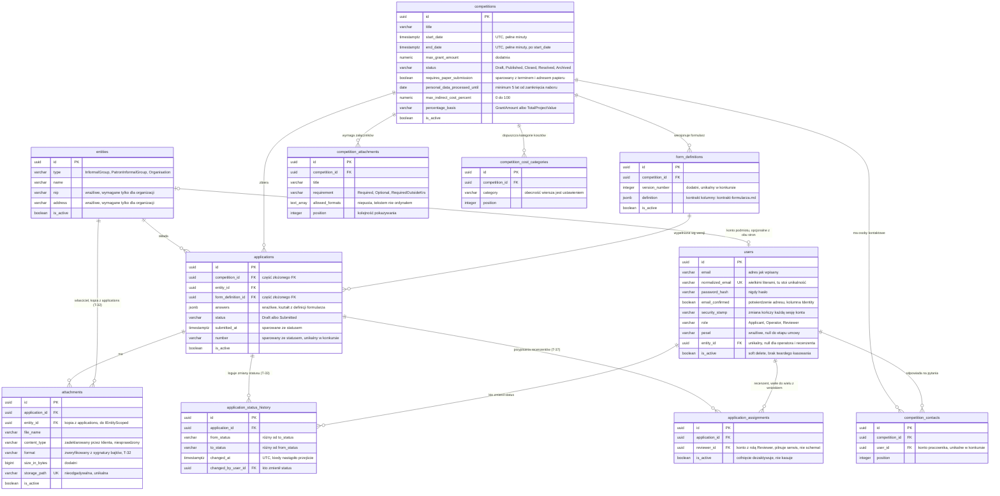
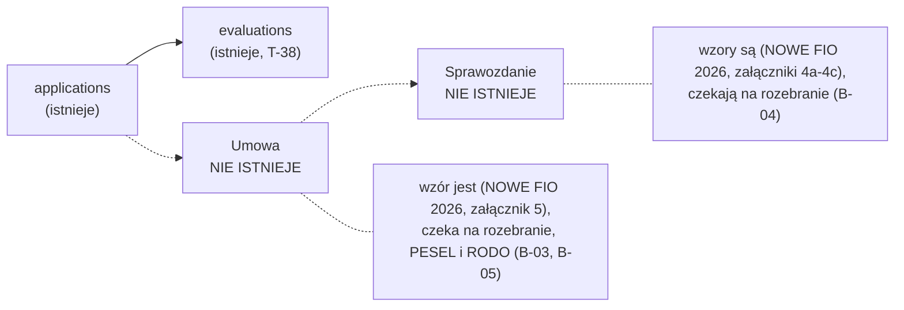

# Model danych

Stan: **wszystkie sześć tabel pierwszego podejścia (`users`, `entities`, `competitions`, `form_definitions`, `applications`, `attachments`) są w `AppDbContext` i w migracjach**, a od `T-33` dochodzi do nich siódma, `application_status_history`, i od `T-37` ósma, `application_assignments`. Od T-12.0 stoją przy nich trzy tabele ASP.NET Core Identity, `user_claims`, `user_logins` i `user_tokens`, czyli w bazie jest jedenaście tabel domenowych, a nie sześć. Te trzy są **puste i mają takie zostać**, powód niżej, przy `users`. Ten dokument opisuje kierunek i, co ważniejsze, jawnie oddziela ustalenia od założeń.

Kto przyjdzie do projektu za miesiąc, musi umieć odróżnić jedno od drugiego.

## Diagram

Jedenaście tabel domenowych: osiem rdzeniowych (sześć pierwszego podejścia plus `application_status_history` z `T-33` i `application_assignments` z `T-37`) i trzy listy parametrów konkursu, dołożone w `T-20a`. Nazwy tabel i kolumn są takie jak w bazie, żeby diagram dało się zestawić z migracją bez tłumaczenia. Pokazane są klucze i te kolumny, o których faktycznie się rozmawia, a nie wszystkie: pełną listę ma `\d <tabela>` w psql. Trzech tabel Identity **celowo tu nie ma**: żadnej z nich nie zapisujemy, więc na diagramie danych byłyby trzema prostokątami bez treści, a to, dlaczego istnieją, jest opisane słowami przy `users`.



Trzy rzeczy, których diagram sam nie powie, a które są sednem tego modelu:

- **`applications` wskazuje na `form_definitions`, a nie na `competitions`**, mimo że trzyma oba klucze. Formularz da się edytować w trakcie naboru, więc wniosek musi pamiętać, według której wersji był wypełniany.
- **Klucz obcy na `form_definitions` jest złożony** i celuje w klucz alternatywny `(competition_id, id)`. Bez tego para konkurs plus wersja formularza mogłaby się rozjechać. Uzasadnienie w [`architektura.md`](architektura.md).
- **Żadna z tych relacji nie kasuje kaskadowo.** Retencja minimum 5 lat, więc `is_active` na każdej tabeli nie jest ozdobą, tylko jedynym sposobem "usuwania".

### Encje odroczone

Dwie encje, których na diagramie **nie ma i nie będzie do czasu, aż rozbierzemy dokumenty**. Nie są zapomniane, są zablokowane. Trzecia, ocena, istnieje od T-38 (niżej, "Ocena").



Linie przerywane to miejsca, w których te encje **prawdopodobnie** się podepną. Prawdopodobnie, bo nawet krotność jest zgadywaniem: nie wiemy, czy jeden wniosek dostaje jedną ocenę czy kilka. Dlaczego tego nie modelujemy, mówi sekcja niżej.

## Encje, których świadomie NIE budujemy

**Umowa, Sprawozdanie.** Ocena była na tej liście do T-38.

Powód jest konkretny: wzory tych dokumentów mamy od 2026-09-25 (konkurs Kierunek NOWE FIO 2026, `runbook/blokery.md`), ale nie są jeszcze rozebrane na model i przejrzane, tak jak zrobiła to z oceną T-38.0. Modelowanie przed tym byłoby zgadywaniem, a zgadywanie w modelu danych kosztuje najwięcej.

Każda z tych trzech czeka na konkretny papier, nie na czyjąś decyzję projektową:

| Encja | Czeka na | Karta |
|---|---|---|
| Umowa | Wzór umowy od prawnika OCWIP. Tu wchodzą PESEL-e, więc razem z nim wchodzi RODO | B-05 |
| Sprawozdanie | Wzór sprawozdania. Bez niego nie wiemy nawet, czy jest jedno na wniosek, czy kilka cząstkowych | B-02 (ta sama rozmowa) |

Lepiej mieć mniej tabel pewnych niż więcej zmyślonych. Dopóki te wiersze mają wypełnioną kolumnę "czeka na", encji nie ma w schemacie.

## Encje planowane w pierwszym podejściu

### Użytkownik (`users`)

Konto do logowania. Ma rolę: operator, wnioskodawca albo recenzent.

Istnieje. Rola trzymana jako tekst, tak samo jak status konkursu i z tego samego powodu. Domyślną rolą jest `Applicant`, zapisaną zarówno w encji, jak i jako wartość domyślna kolumny, żeby insert omijający EF, czyli dokładnie ta droga, którą powstaje operator, też lądował na najmniej uprzywilejowanej roli. Jest to **jedyny** enum tekstowy w tym schemacie ograniczony check constraintem do swoich wartości (`ck_users_role_is_known`), bo jako jedyny jest kolumną uprawnień zapisywaną ręcznym SQL-em, gdzie `'operator'` małą literą zostawiłoby konto w roli, której nie dopasuje żadna reguła. Roli operatora nie nadaje żaden endpoint ani ekran, tylko komenda `grant-role`, patrz [`architektura.md`](architektura.md). Na roli nie ma żadnego ograniczenia unikalności i ta nieobecność ma **test dowodzący**, że constraintu nie ma: konkursy w OCWIP prowadzi więcej niż jedna osoba. E-mail unikalny indeksem w bazie, nie sprawdzeniem w kodzie: `SELECT` przed `INSERT` przegrywa wyścig z drugą rejestracją w tej samej chwili, a dwa konta na jeden adres psują reset hasła. Indeks stoi na `normalized_email`, czyli na adresie zapisanym wielkimi literami, i to jest **ustalenie, nie założenie**: `Adam@x.pl` i `adam@x.pl` to jedno konto. Wcześniej unikalność stała na adresie jak wpisany, więc oba były przyjmowane, a reset hasła miał dwa wiersze do wyboru. `Pesel` jest nullable, bo pojawia się dopiero na etapie umowy, a wymagana kolumna kazałaby każdemu wcześniejszemu kontu nosić wartość zastępczą, która przechodzi każdą walidację. Relacja do podmiotu jest opcjonalna, bo operator i recenzent pracują dla OCWIP i nie składają wniosków. Znaczniki czasu to `DateTimeOffset`, nie `DateTime`: `DateTime` zmapowany na `timestamptz` tylko przenosi problem na `DateTimeKind`, patrz [`architektura.md`](architektura.md).

Konto dziedziczy po ASP.NET Core Identity, ale tabela nadal nazywa się `users`, a decyzja i jej cena są w [`architektura.md`](architektura.md). Trzy rzeczy z tego wynikają dla schematu.

**Weryfikacja adresu to `email_confirmed` z Identity, nie nasza flaga.** Kolumna `is_verified` została usunięta, a jej wartość **przepisana** do `email_confirmed`, i dopiero potem skasowana. Jedno pole na jeden fakt: weryfikację zapisuje `UserManager` w T-12.2, więc druga flaga byłaby tą, której nikt nie aktualizuje. To samo jedno pole jest powodem, dla którego kolejność w migracji nie jest kosmetyką: skasowanie starej kolumny przed przepisaniem cofa każde potwierdzone konto do niepotwierdzonego, cicho i bez wpisu w żadnym logu. `IdentityMigrationTests` sprawdza to na wierszach, bo `MigrationTests` migruje bazę pustą i żadne zdanie ruszające dane tam się nie wykonuje.

**Trzy tabele Identity stoją puste:** `user_claims`, `user_logins` i `user_tokens`. Nie wydajemy claimów (rola jest kolumną), nie mamy logowania zewnętrznego ([`zakres.md`](zakres.md) nie przewiduje SSO) i nie przechowujemy tokenów aplikacji uwierzytelniającej. Nie da się ich usunąć bez napisania własnego `IUserStore`, czyli bez pisania tego, czego uniknięcie jest sensem wyboru Identity, więc zostają i są objęte sprawdzeniem pustości w `scripts/seed.py`. Ich klucze obce do konta przychodzą z `CASCADE` i są przestawione na `NO ACTION`, patrz reguła 1, a `user_claims.id` jest jedynym kluczem głównym w schemacie, który nie jest UUID-em, patrz reguła 3.

**Oba stampy Identity są `NOT NULL` z wartością domyślną z bazy** (`gen_random_uuid()::text`). `IdentityUser` inicjalizuje w konstruktorze `concurrency_stamp` i **nie inicjalizuje** `security_stamp`, więc każdy insert omijający `UserManager`, czyli `scripts/seed.py` i testy schematu, zostawiałby konto bez stampa. Konto bez `security_stamp` to konto, którego sesji nic nie kończy, a to jedyna rzecz, po którą Identity tu jest, patrz [`architektura.md`](architektura.md). Wartość domyślna liczy się per wiersz, nie raz na instrukcję, i ma to test: wspólny stamp dla wszystkich kont byłby gorszy od brakującego, bo jedno wylogowanie kończyłoby wszystkie sesje w systemie, a oba wyglądają na wypełnione.

**Trzech kolumn Identity nie ma w modelu:** `phone_number`, `phone_number_confirmed` i `two_factor_enabled`, wyłączone przez `Ignore`. Nieobecność ma test dowodzący. Adres jest w tabeli dwukrotnie więcej, niż wymaga domena: `user_name` i `normalized_user_name` powtarzają e-mail, bo Identity wymaga nazwy użytkownika, a my identyfikujemy konto adresem. Nazwa użytkownika **nie ma** indeksu unikalnego, żeby duplikat rejestracji zawsze padał na jednej, przewidywalnej nazwie constraintu. Skoro powtarza adres, filtr znaków nazwy użytkownika w Identity jest wyłączony, powód w [`architektura.md`](architektura.md).

### Podmiot (`entities`)

Ten, kto składa wniosek. **To nie jest to samo co użytkownik.**

Jedna encja z polem typu, nie trzy tabele. Trzy typy: grupa nieformalna, grupa nieformalna pod patronatem organizacji, organizacja. NIP i adres są wymagane tylko dla organizacji, więc walidacja jest zależna od typu, a nie wymuszona przez NOT NULL na wszystkich kolumnach. Podmiot bez NIP-u to nie błąd danych, to grupa nieformalna.

Istnieje. Wymagalność zależna od typu **nie jest** też check constraintem, i to jest decyzja, nie przeoczenie: nie wiemy, czy grupa pod patronatem organizacji podaje NIP patrona, więc schemat by tu zgadywał. Ta walidacja siedzi na brzegu API. Typ trzymany jako tekst w kolumnie na 30 znaków, bo `PatronInformalGroup` ma już 19 i przyjęte dla pozostałych enumów 20 nie zostawiałoby miejsca na zmianę nazwy.

### Konkurs (`competitions`)

Data i godzina startu oraz zamknięcia (UTC, pełne minuty), maksymalna kwota dotacji, wymagane załączniki, status.

Istnieje. Status trzymany jako tekst, nie jako ordynał enuma: wstawienie albo przestawienie wartości w `CompetitionStatus` przeinterpretowałoby po cichu wszystkie istniejące wiersze. Baza pilnuje dwóch rzeczy, których komentarz nie utrzyma: `start_date < end_date` (inaczej powstaje konkurs zamknięty przed otwarciem, do którego nigdy nie da się złożyć oferty) oraz `max_grant_amount > 0`. Okno konkursu przechowywane w pełnych minutach: settery `StartDate` i `EndDate` ucinają sekundy, a dwa check constraints pilnują tego samego w bazie, żeby insert omijający encję nie wpisał `12:00:30`. Ucinanie celowo nie jest konwerterem, powód w [`architektura.md`](architektura.md). Znaczniki audytowe (`created_at`, `updated_at`) zachowują pełną precyzję, bo odpowiadają na inne pytanie. Indeks na `(status, end_date)`, bo po tej parze filtruje się publiczna lista konkursów. Wymagane załączniki jeszcze nie istnieją, wchodzą razem z encją załącznika.

T-20 dołożył pięć rzeczy. **Numer konkursu** (format typu `1/2026`), unikalny, bo tym numerem organizacja posługuje się poza systemem, na umowach i w korespondencji; indeks jest **filtrowany po `is_active`**, więc konkurs dezaktywowany oddaje swój numer, inaczej jedna literówka blokowałaby prawdziwe `1/2026` na całe pięć lat retencji. **`published_at`**, stempel chwili publikacji, nadawany przez przejście, nie przez formularz. **`is_continuous_intake`** razem z **nullowalnym `end_date`**, sparowane szóstym check constraintem `(end_date IS NULL) = is_continuous_intake`: nabór ciągły nie ma terminu zakończenia, a data odsunięta daleko w przyszłość nadal jest datą i kiedyś by ten nabór zamknęła. **`form_definition_id`**, wskazanie wersji formularza w mocy, z FK **złożonym** na `(id, form_definition_id)` przeciw kluczowi alternatywnemu `(competition_id, id)` na `form_definitions`: klucz jednokolumnowy przyjąłby wskazanie na formularz cudzego konkursu i wiersz wyglądałby poprawnie.

`T-20a` dołożył parametry kroków 1.2 do 1.6 kreatora. Wszystkie są **nullowalne albo mają wartość domyślną**, bo kreator nie blokuje przechodzenia między krokami, a kompletność sprawdzamy dopiero przy publikacji. Na `competitions` siedzą: zakładane rezultaty i adres regulaminu, dwie treści pokazywane po złożeniu wniosku (ekran i e-mail, osobne pola), przełącznik wersji papierowej razem z terminem i adresem, ramy realizacji zadań jako `date`, pula konkursu, dotacja minimalna, dwa procenty w `numeric(5,2)`, podstawa liczenia procentu, próg średniego rocznego przychodu, data przetwarzania danych osobowych oraz dwa limity uploadu. Dziewięć nowych check constraints pilnuje tego, czego komentarz nie utrzyma: sparowania trzech pól papieru w obie strony, pełnej minuty na terminie papierowym, kolejności ram projektu (równe daty wolno, bo jednodniowy projekt istnieje), dodatnich kwot, minimalnej dotacji w granicach maksymalnej, procentów w zakresie 0 do 100 oraz limitu pliku nieprzekraczającego limitu wniosku. **Próg przychodu przyjmuje zero**, bo zero jest tam ustawieniem, a nie pustym polem: `null` znaczy brak progu.

Trzy listy poszły do osobnych tabel, nie do JSON-a: `competition_attachments` (wymagane załączniki, `T-32` dołoży im wzór pliku jako klucz obcy, i to jest powód, dla którego to tabela), `competition_contacts` (wskazanie konta pracownika, nie kopia nazwiska i adresu, żeby strona konkursu nie pokazywała kontaktu do kogoś, kto odszedł) oraz `competition_cost_categories`, gdzie **obecność wiersza jest ustawieniem** (`R-12`): brak wiersza wyłącza kategorię razem z jej sekcją opisową. Wszystkie trzy mają `NoAction` jak reszta schematu (reguła 1), więc wiersze porzucone przy edycji kasuje jawnie `CompetitionService`, a nie niewidoczna kaskada.

Statusów jest **siedem**, nie cztery (`R-17`), a stan **efektywny** nie jest tym, co stoi w kolumnie: przejścia terminowe (`opublikowany -> trwa nabór -> nabór zamknięty`) liczą się przy odczycie z dat, a kolumna trzyma ostatni stan wybrany przez człowieka. Uzasadnienie w [`architektura.md`](architektura.md).

### Definicja formularza (`form_definitions`)

Struktura formularza jako dokument JSONB plus numer wersji. Wersjonowana, bo operator może edytować formularz w trakcie życia konkursu.

Zawartość tego JSON-a, czyli jak wyglądają sekcje, pola i walidacje, opisuje [`kontrakt-formularza.md`](kontrakt-formularza.md) (`T-24`).

Od T-38 wiersz ma **przeznaczenie** (`purpose`: `Application`, `FormalEvaluation`, `MeritEvaluation`), bo ten sam mechanizm wersjonuje karty oceny (D16). Numer wersji jest unikalny w obrębie pary konkurs plus przeznaczenie, a konkurs wskazuje wersję w mocy każdej z trzech (`form_definition_id`, `formal_card_definition_id`, `merit_card_definition_id`), wszystkie złożonym kluczem obcym. Model oceny: sekcja "Ocena wniosku" niżej.

Schemat nie zmienił się w `T-25`, zmieniło się to, kto wolno mu pisać. Wiersz powstaje wyłącznie przez publikację kolejnej wersji, numer to `max + 1` liczone razem z wersjami nieaktywnymi (numer raz zużyty nie wraca), a zapisanego dokumentu nie podmienia nic: nie ma trasy, która by to robiła. Wskazanie `competitions.form_definition_id` przesuwa się na nową wersję, `applications.form_definition_id` nie rusza się nigdy. Uzasadnienie w [`architektura.md`](architektura.md).

Istnieje. Numer wersji jest unikalny w obrębie konkursu, nie globalnie: wersja 1 musi móc istnieć w każdym konkursie, a dwa wiersze z tą samą wersją w jednym konkursie odbierałyby możliwość stwierdzenia, przeciw której wersji formularza wypełniono ofertę. Numer wersji musi być dodatni, a korzeń JSON-a musi być obiektem albo tablicą, oba pilnowane check constraintem: bez tego kolumna przyjmuje `-7` jako wersję i `123` jako definicję formularza. Który z dwóch korzeni wybiera kontrakt, rozstrzygnęło T-24: jest to **obiekt** z wersją kontraktu i listą sekcji, opisany w [`kontrakt-formularza.md`](kontrakt-formularza.md). Constraint zostaje szerszy, bo pilnuje kształtu, a nie treści. JSON siedzi w kolumnie jako `JsonElement`, nie `JsonDocument`: EF nigdy nie zwalnia zmaterializowanych instancji, a `JsonDocument` jest `IDisposable` i oparty o `ArrayPool`, więc zapytanie listujące alokowałoby jedną na wiersz.

### Wniosek (`applications`)

Odpowiedzi jako JSONB. Wskazuje na Podmiot oraz **na konkretną wersję definicji formularza, nie na konkurs.** Uzasadnienie w [`architektura.md`](architektura.md).

Brak ograniczenia unikalności na parze podmiot plus konkurs: jeden podmiot może złożyć kilka ofert w jednym konkursie.

Istnieje. Ta nieobecność jest wymogiem, nie luką, więc ma **test dowodzący, że constraintu nie ma**. Komentarz by nie przeżył pierwszej osoby, która dostrzeże "oczywisty brakujący constraint".

Wniosek trzyma obok siebie `competition_id` i `form_definition_id`, choć wersja formularza sama należy do konkursu. Dwa zwykłe klucze obce pozwoliłyby tej parze się rozjechać, więc klucz obcy na definicję formularza jest **złożony** i wskazuje na klucz alternatywny `(competition_id, id)`. Powód i alternatywy w [`architektura.md`](architektura.md).

Status jest jednym z dwóch: `Draft` albo `Submitted`. Dalsze stany, czyli wszystko, co dzieje się na liście rankingowej, należą do encji oceny, której świadomie nie budujemy. Data złożenia i numer wniosku są sparowane ze statusem osobnymi check constraintami: złożonej oferty, której nikt nie potrafi zadatować, nie da się użyć w sporze o termin, a wersja robocza z datą złożenia czyta się jednocześnie jako niewysłana i wysłana. Numer nadawany jest przy złożeniu, więc wersja robocza go nie ma i nie zużywa, bo rejestr z lukami po nigdy niezłożonych wersjach roboczych jest rejestrem, którego operator nie umie wyjaśnić wnioskodawcy. Korzeń JSON-a z odpowiedziami musi być obiektem albo tablicą, tym samym constraintem co przy definicji formularza.

### Historia zmian statusu (`application_status_history`)

Dopisywana, nigdy nadpisywana (T-33). Jeden wiersz na przejście: `application_id`, `from_status`, `to_status`, `changed_at` w UTC, `changed_by_user_id`. Check constraint odrzuca przejście, które niczego nie zmienia (`from_status <> to_status`).

Istnieje wyłącznie dlatego, że kolumna `applications.status` byłaby inaczej jedynym śladem stanu wniosku: nadpisanie jej przy złożeniu zabrałoby ze sobą jedyny dowód, że wniosek kiedykolwiek był wersją roboczą. `FromStatus`/`ToStatus` używają tego samego enuma co `Application.Status`, nie tylko pary Draft/Submitted, którą ta karta faktycznie zapisuje: przyszłe przejście Submitted do Draft (`R-03`, zwrot do poprawy, bez karty na Trello) ma gdzie wylądować bez zmiany schematu.

Zero `ON DELETE CASCADE` w obie strony (reguła 1): dezaktywacja wniosku albo konta nie zabiera ze sobą jego historii.

### Przypisanie recenzenta (`application_assignments`)

Kto ocenia który wniosek (T-37): `application_id`, `reviewer_id`, `is_active`. Wiele do wielu, nie jeden do jednego: jeden wniosek może mieć kilku recenzentów i jeden recenzent kilka wniosków. Karta na Trello zostawia otwarte pytania, na które odpowiada dopiero wzór karty oceny (B-02): ilu recenzentów ocenia jeden wniosek, co przy rozbieżnych ocenach, czy ocena jest anonimowa. Do czasu odpowiedzi model jest zaprojektowany jako relacja wiele do wielu z tego samego powodu co gdzie indziej w tym dokumencie: zawężenie jej później jest tanie, rozszerzenie drogie.

Istnieje. `reviewer_id` to zwykły klucz obcy do `users`, bez ograniczenia roli w schemacie: to, że tylko konto z rolą `Reviewer` i `is_active = true` może zostać przypisane, pilnuje `ApplicationAssignmentService`, nie baza, tym samym podziałem odpowiedzialności co przy typie podmiotu. Jeden wiersz na parę wniosek plus recenzent (unikalny indeks): cofnięcie przypisania (reguła 1, brak twardego kasowania) ustawia `is_active = false` zamiast usuwać wiersz, a ponowne przypisanie tej samej pary reaktywuje ten sam wiersz zamiast wstawiać drugi, więc pytanie "który wiersz jest aktualny" nigdy się nie pojawia.

Reguła widoczności, dla której ta tabela istnieje, siedzi w warstwie autoryzacji (`Authorization/EntityScopedHandler.cs`, T-13.2), nie tutaj: recenzent widzi wniosek wtedy i tylko wtedy, gdy istnieje dla niego aktywny wiersz w tej tabeli. Ponieważ wiersz wskazuje wniosek, nie konkurs, przypisanie w jednym konkursie nie odblokowuje żadnego wniosku w innym.

### Załącznik (`attachments`)

Metadane pliku, powiązanie z wnioskiem i fizyczne przechowywanie na dysku lokalnym pod `Attachments:StoragePath` (T-32, `Services/AttachmentStorageService.cs`).

Istnieje: nazwa pliku, typ MIME zadeklarowany, format zweryfikowany, rozmiar, ścieżka w storage, `entity_id`. Typ MIME jest **zadeklarowany przez klienta, nie sprawdzony**, i kolumna mówi to wprost, bo inaczej następny czytający uzna ją za wiarygodną: decyzję o formacie podejmuje osobna kolumna, `format`, wypełniana z sygnatury bajtów pliku przez `AttachmentFormatDetector`, nigdy z deklaracji. Rozmiar musi być dodatni, bo załącznik zerobajtowy to nieudany upload, nie dokument. Ścieżka w storage jest unikalna: dwa wiersze wskazujące na jeden plik zamieniają usunięcie pliku w sposób psucia cudzego załącznika. Ścieżka nie może dać się zgadnąć, a pobranie musi przechodzić tę samą kontrolę uprawnień co sam wniosek, bo załącznik to dokument cudzej organizacji: `entity_id` to kopia `applications.entity_id` zapisana przy uploadzie, żeby handler autoryzacji (`IEntityScoped`) czytał właściciela z samego wiersza załącznika, bez joina do wniosku.

Podmiana pliku (T-32) nigdy nie nadpisuje wiersza: wstawia nowy, a poprzedni oznacza `is_active = false` bez kasowania jego bajtów na dysku, ten sam wzorzec soft delete co reszta modelu (reguła 1).

## Ocena wniosku (model z T-38.0, zbudowany w T-38)

**Stan: zaakceptowany 2026-09-25 i zbudowany w T-38, z dwiema zmianami względem pierwotnej propozycji.** Kryteria formalne są osobnymi polami tak/nie z rolą `formalCriterion`, a nie wierszami tabeli o stałej liczbie wierszy: warunek "kryterium tylko dla organizacji" na wierszu byłby nowym pojęciem kontraktu, na polu już istnieje. Ustawienia oceny w konkursie (tabela niżej) przeszły do T-39, bo czyta je tylko ranking, i tam istnieją: kolumny na `competitions`, ustawiane osobną trasą operatora. Wynik i lista rankingowa są liczone przy odczycie, nigdy zapisywane; interpretacje przyjęte bez potwierdzenia w [`runbook/zalozenia-robocze.md`](runbook/zalozenia-robocze.md). Źródło modelu: dokumenty konkursu Kierunek NOWE FIO 2026 ([`runbook/blokery.md`](runbook/blokery.md), B-02) i decyzja D16. Kształt właściwości kontraktu: [`kontrakt-formularza.md`](kontrakt-formularza.md), sekcja "Karta oceny".

### Zasada: karta oceny to formularz

Struktura karty oceny jest dokumentem w `form_definitions`, tym samym kontraktem ([`kontrakt-formularza.md`](kontrakt-formularza.md)), walidatorem, kalkulatorem, rendererem i przyszłym kreatorem co wniosek. Tak mówią już raport i sekcja T-38 w [`runbook/M5-ocena.md`](runbook/M5-ocena.md), a D16 każe, żeby kreator wyrósł z jednego modelu, nie z kilku.

Odrzucone:

- **Osobne tabele kryteriów** (`evaluation_criteria` z wierszem na kryterium i kolumną punktów). Czytelne w SQL, ale to drugi mechanizm struktury obok formularza: drugi walidator, drugi renderer, drugi kreator. Karta 2026 potrzebuje też tego, co formularz już umie (tabela kwestionowanych pozycji budżetu, kwota, pole wyliczane), więc tabela kryteriów i tak skończyłaby jako formularz, tylko gorszy.
- **Kryteria w kodzie.** Łamie D2: zmiana kryterium w kolejnej edycji wymagałaby programisty.

### Definicja karty: `form_definitions` z przeznaczeniem

- Nowa kolumna **`purpose`**: `application`, `formalEvaluation`, `meritEvaluation` (później `report` dla sprawozdania). Tekst, nie ordynał enuma, z tego samego powodu co status konkursu. Istniejące wiersze dostają `application`.
- Numer wersji unikalny w obrębie pary (konkurs, `purpose`), nie samego konkursu: wersja 1 karty merytorycznej nie może kolidować z wersją 1 formularza wniosku.
- Konkurs wskazuje wersję w mocy każdej karty: **`formal_card_definition_id`** i **`merit_card_definition_id`**, obok istniejącego `form_definition_id`, z tym samym złożonym kluczem obcym na `(competition_id, id)`. Zgodność `purpose` wskazanego wiersza pilnuje serwis publikacji z testem: baza nie wyrazi kluczem obcym stałej wartości w kolumnie bez kolumny generowanej, a to do rozstrzygnięcia przy implementacji, nie tutaj.
- Wersjonowanie i publikacja jak w T-25: wiersz powstaje tylko przez publikację, dokument nigdy nie jest podmieniany, ocena wskazuje wersję, na której ją wypełniono.

### Karta oceny formalnej 2026 jako dokument

Nagłówek papierowej karty (numer wniosku, nazwa wnioskodawcy, tytuł projektu, imię i nazwisko oceniającego) **nie jest polem**: renderer bierze go z wniosku i z oceny, bo te wartości już są w bazie.

| Element papieru | Pole w dokumencie | Uwagi |
|---|---|---|
| 8 kryteriów "spełnia / nie spełnia" | na kryterium: `yesNo` (wymagane) z rolą `formalCriterion` plus `longText` z uzasadnieniem (opcjonalne) | raport chce miejsca na uzasadnienie przy każdym kryterium, papier go nie ma; opcjonalne, żeby nie dokładać pracy tam, gdzie wszystko się zgadza |
| kryterium "w przypadku młodej/lokalnej organizacji: przychód do 50 000 zł" i "w przypadku młodej organizacji: rejestracja nie wcześniej niż 60 miesięcy" | pole kryterium z `appliesTo: ["Organisation"]` (R1 niżej) | kryterium, które nie dotyczy rodzaju wnioskodawcy, nie jest pokazane i nie liczy się do wyniku. Sprawdzenie członków grupy wobec organów patrona to część kryterium ogólnego o uprawnionym wnioskodawcy, nie osobne kryterium, więc stoi w jego podpowiedzi. Karta 2026 jako dokument: `backend/seed/evaluation-cards/formal-2026.json` (T-38b) |
| wynik karty | nie pole: **pozytywny, gdy każde zadane kryterium ma "tak"** | liczony przy odczycie (`EvaluationScores`) |

### Karta oceny merytorycznej 2026 jako dokument

| Element papieru | Pole w dokumencie | Uwagi |
|---|---|---|
| 4 kryteria (pomysł i cel 0-20, rezultaty 0-16, promocja 0-10, budżet 0-4) z pytaniami pomocniczymi | na kryterium: `number` z `minValue`/`maxValue` (punkty, pytania pomocnicze w `help`) plus `longText` "Uzasadnienie przyznanej punktacji", oba wymagane | punkty i uzasadnienie to dwa pola, nie jedno, bo tylko punkty się sumują |
| "SUMA: 0-50 punktów" | `calculated`, `sum` czterech pól punktów, rola `meritScore` (R3) | |
| "Proponowana kwota dotacji" | `amount`, rola `recommendedGrant` (R3) | ta kwota idzie na listę rankingową i do decyzji operatora (T-42) |
| "Kwestionowane pozycje w budżecie" | `repeatableTable`: `nazwa_pozycji` (`shortText`), `kwota_kwestionowana` (`amount`), `kwota_rekomendowana` (`amount`) | |
| "Proponowana kwota dofinansowania po uwzględnieniu kwestionowanych pozycji" | do ustalenia (pytanie P3) | papier ma dwie kwoty proponowane i nie mówi, jak się mają do siebie |
| uzasadnienie obniżenia kwoty (dopisek raportu, papieru tego nie ma) | `longText`, opcjonalne | wymagane tylko przy obniżce to reguła porównania dwóch kwot, której kontrakt nie ma; do czasu decyzji opcjonalne |
| 3 kryteria strategiczne tak/nie po 1 pkt z kolumną "kogo dotyczy" | `yesNo` z `points: 1` (R2) i `appliesTo` (R1): białe plamy (wszyscy), grupa z patronem (grupy nieformalne), organizacja bez wsparcia NOWE FIO 2024 i 2025 (organizacje) | |
| suma strategiczna | `calculated`, `sum` trzech pól tak/nie, rola `strategicScore` (R3) | |
| "Łączna liczba punktów" | nie pole: `meritScore + strategicScore`, liczone przy odczycie | |

Fragment dokumentu dla jednego kryterium:

```json
{ "key": "rezultaty_punkty", "type": "number", "label": "Rezultaty",
  "help": "W jakim stopniu zakładane rezultaty są wymierne i możliwe do osiągnięcia? Czy projekt przyniesie trwałe rezultaty?",
  "required": true, "printed": true, "minValue": 0, "maxValue": 16 },
{ "key": "rezultaty_uzasadnienie", "type": "longText", "label": "Uzasadnienie przyznanej punktacji",
  "help": "", "required": true, "printed": true, "maxLength": 3000 }
```

### Ocena: nowa tabela `evaluations`

Jeden wiersz na kartę wypełnioną przez jedną osobę dla jednego wniosku.

| Kolumna | Znaczenie |
|---|---|
| `id` | |
| `application_id`, `competition_id` | wniosek i jego konkurs, para spięta złożonym kluczem obcym jak w `applications` |
| `stage` | `formal` albo `merit`, tekst |
| `form_definition_id` | wersja karty, na której oceniono, złożony klucz obcy na `(competition_id, id)`; nigdy się nie zmienia, jak przy wniosku |
| `author_user_id` | kto ocenia; nullowalne tylko razem z `author_name` |
| `author_name` | autor spoza systemu (komisja obradująca na papierze, decyzja 14 raportu), wpisany tekstem; check constraint: dokładnie jedno z dwóch |
| `entered_by_user_id` | kto wprowadził kartę do systemu; przy ocenie własnej to ta sama osoba co autor (decyzja 14: autor osobno od wprowadzającego, tanie teraz, drogie po wdrożeniu) |
| `answers` | JSONB, odpowiedzi w kształcie z kontraktu, walidowane walidatorem z T-30 na dwóch poziomach: szkic przy zapisie, pełny przy zakończeniu |
| `status` | `draft` albo `finished` ("zapisz" kontra "zapisz i zakończ etap", krok 5.4) |
| `finished_at` | sparowane ze statusem check constraintem, jak data złożenia wniosku |
| `is_active`, `created_at`, `updated_at` | brak twardego kasowania (reguła 5) |

Ograniczenia: najwyżej jedna aktywna ocena formalna na wniosek (indeks częściowy, ocenę formalną robi jedna osoba z operatora); najwyżej jedna aktywna ocena merytoryczna na parę wniosek plus autor. To, że ocenę merytoryczną może wypełnić tylko osoba z aktywnym wierszem w `application_assignments`, pilnuje serwis i warstwa autoryzacji z T-37, nie baza, tym samym podziałem co dziś.

**Wyniki nie są zapisywane.** Suma punktów, wynik formalny, pozycja na liście liczą się przy odczycie z odpowiedzi tym samym kalkulatorem co limity wniosku. Zapisana suma byłaby drugim faktem obok odpowiedzi, a D15 już raz odrzuciło taki podwójny fakt.

Odrzucone: **odpowiedzi w wierszach** (ocena, kryterium, punkty). Kształt odpowiedzi karty wynika z dokumentu, a nie ze schematu, jak przy wniosku; wiersze na kryterium to drugi, równoległy format tych samych danych.

### Ustawienia oceny w konkursie

Raport (krok 5.0) każe trzymać je jako parametry konkursu, a nie stałe. Wartości domyślne z regulaminu 2026:

| Kolumna na `competitions` | 2026 | Źródło |
|---|---|---|
| `evaluators_per_application` | 2 | regulamin, "każdy wniosek oceniany przez 2 niezależnych członków" |
| `score_aggregation` (`sum` albo `average`) | `sum` | regulamin, "100 pkt (suma punktacji dwóch ekspertów)"; raport chce obu wariantów |
| `merit_threshold` (nullowalny, `null` znaczy brak progu) | 50 | regulamin |
| `threshold_includes_strategic` | `false` | regulamin, "nie uwzględniając punktacji za kryteria strategiczne" |
| `divergence_threshold_percent` (nullowalny, `null` wyłącza ostrzeżenie) | brak w regulaminie | raport, domyślnie 30% skali; pytanie P2 |

**Remis nie jest ustawieniem, tylko regułą:** przy równej liczbie punktów wyżej stoi wniosek złożony wcześniej (regulamin 2026, `applications.submitted_at` już jest). Kolumna z jedną możliwą wartością to kod udający konfigurację; jeśli kolejna edycja przyjmie inną zasadę, wtedy staje się ustawieniem.

### Rozszerzenia kontraktu formularza

Wszystkie opcjonalne, więc `schemaVersion` zostaje, jak przy `role` w T-35.

- **R1 `appliesTo`**: lista rodzajów wnioskodawcy (`Organisation`, `InformalGroup`, `PatronInformalGroup`) na polu poza tabelą. Pisownia taka jak `EntityType` na drucie API, nie camelCase reszty kontraktu: druga pisownia tego samego enuma to ten sam rozjazd co `R-34`. Brak znaczy "wszyscy". Pole, które nie dotyczy wniosku, nie jest pokazane i nie jest wymagane. Przyda się też formularzowi wniosku, który dziś ma osobne wzory na każdy rodzaj wnioskodawcy.
- **R2 `points`** na `yesNo`: ile punktów daje odpowiedź "tak". Składnik `sum` liczy takie pole jako `points` albo 0. Bez tego trzy kryteria strategiczne trzeba by udawać polami liczbowymi 0-1.
- **R3 nowe role**: `formalCriterion` (tylko `yesNo`, jedyna powtarzalna), `meritScore`, `strategicScore` (tylko `calculated` z `sum`), `recommendedGrant` (`amount`). Role dozwolone zależnie od `purpose`: role wniosku (`projectTitle`, `totalCost`, `requestedGrant`) tylko na wniosku, role oceny tylko na karcie.
- **R4 walidacja zależna od `purpose`**: karta formalna musi mieć co najmniej jedno pole `formalCriterion`, karta merytoryczna pole `meritScore`. Bez tego da się opublikować kartę, z której nie da się policzyć wyniku.

### Pytania do klientki

- **P1.** Karta merytoryczna numeruje kryteria 1, 2, 3, 5. Czy kryterium 4 zostało usunięte, czy to literówka?
- **P2.** Raport mówi o ostrzeżeniu przy rozbieżności ocen powyżej 30% skali, regulamin 2026 o tym milczy. Czy to obowiązuje?
- **P3.** Karta merytoryczna ma dwie kwoty: "proponowana kwota dotacji" i "proponowana kwota dofinansowania po uwzględnieniu kwestionowanych pozycji". Czym się różnią i czy druga wynika z pierwszej i tabeli?
- **P4.** Czy ekspert może zmienić ocenę po "zakończ etap", i kto może ją otworzyć ponownie?
- **P5.** "Białe plamy": ekspert zaznacza to ręcznie, czy system ma to rozpoznać z gminy we wniosku według listy gmin z regulaminu?

### Deklaracja bezstronności (`reviewer_declarations`, T-40a)

Jedna aktywna decyzja eksperta w konkursie: akceptacja albo odmowa z powodem (check constraint paruje powód z odmową), kopia tekstu, który ekspert widział, data decyzji. Decyzja raz: zmiana to sprawa operatora, nie drugie kliknięcie. Bez akceptacji ekspert nie widzi żadnego wniosku ani karty w tym konkursie, co pilnuje warstwa autoryzacji. Tekst deklaracji jest na razie roboczy (ZR-05).

### Czego model nie obejmuje

uzupełnień i odwołania od oceny formalnej (3 dni, osobne stany wniosku, R-03), dokumentów komisji (krok 5.6), udostępnienia kart wnioskodawcom (krok 5.5), umowy i sprawozdania (B-03, B-04, tym samym wzorem po tej).

### Podział kart

Zrobiony jak przy T-26: **T-38** to mechanizm (przeznaczenie, rozszerzenia kontraktu, tabela `evaluations`, API i uprawnienia), **T-38b** to treść kart 2026, **T-39** to wynik i lista rankingowa razem z ustawieniami oceny i regułą remisu. T-40 i T-41 po T-38.

## Jawne założenia do potwierdzenia

Są to **założenia**, nie ustalenia. Potwierdzić z zamawiającym.

Termin, do którego odwoływały się karty T-11.2, T-11.3 i T-11.4, czyli spotkanie 27.08, **minął, a założenia zostały niepotwierdzone**. Prowadzi to karta B-09 i tam jest checklista do przejścia. Cztery z tych pozycji są już wypalone w schemacie: relacja użytkownik do podmiotu, zakres unikalności numeru wniosku, moment jego nadania oraz zachowanie dezaktywowanego konta. Każda z nich, jeśli jest błędna, oznacza migrację, a nie poprawkę w kodzie. Dziś migracja jest bezkosztowa, bo baza jest pusta. Po pierwszych prawdziwych danych przestaje być.

Potwierdzoną pozycję przenosi się **z tej tabeli do treści właściwej sekcji wyżej**, żeby następna osoba widziała różnicę między ustaleniem a domysłem.

| Założenie | Skąd się wzięło | Co się stanie, jeśli jest błędne |
|---|---|---|
| Użytkownik do Podmiotu jeden do jednego | Nie wiemy, czy w organizacji wniosek może składać kilka osób z osobnych kont | Trzeba dodać tabelę pośredniczącą i przemyśleć uprawnienia w obrębie podmiotu. Dlatego T-12.1 rejestruje **tylko konto**, a zakładanie Podmiotu przy rejestracji ma osobną kartę zależną od B-09: budowanie go na niepotwierdzonym założeniu kupuje migrację, nie funkcję |
| Jedna rola na użytkownika | Na spotkaniu nie padło nic o osobie, która jest jednocześnie operatorem i recenzentem | Rola przestaje być kolumną, staje się relacją, a `ck_users_role_is_known` i wartość domyślna kolumny znikają razem z nią |
| Sprawozdanie jest jedno na wniosek | Standard w małych dotacjach, ale nie ustalone | Relacja jeden do wielu, plus statusy sprawozdań cząstkowych |
| Brak aneksów do umów | Na spotkaniu nie padło ani słowo | Umowa zyskuje wersjonowanie, podobnie jak definicja formularza |
| Numer wniosku nadawany przy złożeniu, nie przy utworzeniu wersji roboczej | Wersja robocza, której nikt nie złożył, zużywałaby numer i zostawiała lukę w rejestrze | Numer staje się kolumną wymaganą od utworzenia, a check constraint parujący go ze statusem znika |
| Numer wniosku unikalny w obrębie konkursu, nie globalnie | Nie znamy schematu numeracji OCWIP. Unikalność globalna odrzuciłaby numer "001" w drugim konkursie, czyli poprawne dane | Nic. Ten zakres nie odrzuca niczego, co wyprodukowałby schemat globalny, bo numer globalnie unikalny jest też unikalny w konkursie |
| Numer wniosku raz nadany nie wraca do puli, nawet gdy wniosek zostanie wycofany | Indeks unikalny na `(competition_id, number)` obejmuje wszystkie wiersze, a reguła 1 zabrania twardego kasowania | Indeks staje się częściowy (`WHERE is_active`), a numer zwolniony przez wycofany wniosek może trafić do kolejnego wnioskodawcy |
| Dezaktywowane konto zachowuje swój e-mail i swój podmiot na zawsze, więc drogą powrotną jest reaktywacja, a nie ponowna rejestracja | Indeksy unikalne na `normalized_email` i `entity_id` obejmują wszystkie wiersze, a reguła 1 zabrania twardego kasowania, więc wiersz nigdy nie zwalnia adresu | Oba indeksy stają się częściowe (`WHERE is_active`), a rejestracja przestaje być jedyną drogą wejścia dla wcześniej dezaktywowanego konta |

## Otwarte punkty implementacyjne

Nie założenia o domenie, tylko rzeczy, których schemat świadomie nie rozstrzyga, a które ugryzą kartę wdrażającą ścieżkę zapisu.

- ~~**Nadawanie numeru wniosku.**~~ Rozstrzygnięte w `T-33`: blokada doradcza na konkurs (`pg_advisory_xact_lock`), nie sekwencja ani ponowienie po `23505`. Uzasadnienie w [`architektura.md`](architektura.md), sekcja o T-33.
- **Reaktywacja konta.** Patrz ostatni wiersz tabeli powyżej. Dezaktywowane konto blokuje swój adres (przez `normalized_email`) i swój podmiot, więc T-12.1 musi mieć ścieżkę reaktywacji, bo sama rejestracja nie da się pogodzić z regułą "nie ujawniamy, czy konto istnieje". T-12.1 tego **nie rozwiązało**, tylko przypięło testem: rejestracja na adres dezaktywowanego konta odpowiada dokładnie jak sukces, więc reguła jest dotrzymana, a człowiek nie wejdzie nigdy. To jest stan znany i udokumentowany, nie niespodzianka, a droga wyjścia należy do osobnej karty.
- **Szyfrowanie odpowiedzi wniosku.** T-80 nie może zaszyfrować całej kolumny `answers`: szyfrogram nie jest ani obiektem, ani tablicą, więc padłby check constraint, a razem z kolumną jsonb zniknęłaby wyszukiwalność, po którą jsonb został wybrany. Szyfrowane są pola WEWNĄTRZ dokumentu, nie dokument.
- **Szerokości kolumn wrażliwych.** `nip` na 10 znaków i `pesel` na 11 mieszczą dokładnie tekst jawny i zero szyfrogramu. T-80 musi te kolumny poszerzyć, inaczej pierwszy zaszyfrowany zapis wywali 22001.
- **Brak powiązania między załącznikiem wnioskodawcy a wymaganym załącznikiem konkursu.** `attachments` (T-32) nie niesie żadnego wskazania, który wiersz `competition_attachments` plik zaspokaja: to dwie osobne tabele bez klucza między nimi. Skutek: `T-33` **nie sprawdza** przy złożeniu, czy komplet wymaganych załączników jest dołączony, bo policzenie samych plików bez dopasowania do konkretnego wymogu byłoby zgadywaniem, a `AttachmentRequirement.RequiredOutsideKrs` nie da się w ogóle wyliczyć, dopóki `entities` nie ma pola rejestru. Blokada listy braków w kroku 3.7 kreatora jest na razie zadaniem samego frontu (`T-34`). Karta, która dopina powiązanie po stronie backendu, jeszcze nie istnieje.

## Reguły, które model musi respektować

1. Zero `ON DELETE CASCADE`. Retencja minimum 5 lat wyklucza twarde kasowanie. Soft delete to `IsActive` plus nullable `DeactivatedAt`, sparowane check constraintem, patrz [`architektura.md`](architektura.md). **Bez wyjątków, także dla klucza, którego nie napisaliśmy sami:** trzy tabele Identity przychodzą z `CASCADE` na koncie i są w `AppDbContext` przestawione na `NO ACTION`. To, że stoją puste, nie jest argumentem, bo cascade odpala się dokładnie tego dnia, w którym ktoś kasuje konto. Reguła ma test przechodzący po **całym** modelu, a nie po wymienionych relacjach: poprzedni pilnował po jednej i dlatego przepuścił klucze, których nikt nie napisał ręcznie.
2. Wszystkie znaczniki czasu w UTC. Wymusza to `UtcDateTimeOffsetConverter` na każdej właściwości `DateTimeOffset`, patrz [`architektura.md`](architektura.md).
3. Klucze główne jako UUID (`gen_random_uuid()`), nie sekwencje. Identyfikator wniosku pojawia się w adresie URL, a sekwencja mówi konkurentowi, ile wniosków wpłynęło i pozwala zgadywać cudze. **Jeden wyjątek, `user_claims.id`:** jest to `int` z sekwencji, bo klucz definiuje `IdentityUserClaim<Guid>` z paczki, a jego typ jest częścią tej klasy, nie naszą decyzją. Przepisanie na UUID znaczy własny typ claima i własny `IUserStore`. Wyjątek jest bezpieczny, bo powód reguły tu nie zachodzi: tabela jest pusta, jej identyfikator nie pojawia się w żadnym adresie URL i nikomu nie mówi, ile czegokolwiek wpłynęło. Gdyby kiedyś zaczęła być zapisywana, ten wiersz jest miejscem, w którym decyzję trzeba podjąć jeszcze raz.
4. Każde pole trzymające dane wrażliwe (PESEL, NIP, adres osoby fizycznej) oznaczone komentarzem w kodzie.

## Dane testowe

Jedna komenda na wstającym stacku:

```bash
python scripts/seed.py
```

Wstawia dokładnie to, czego wymagają testy uprawnień, a nie ozdobę: jednego operatora, dwóch wnioskodawców, jeden konkurs i dwa wnioski, z czego jeden roboczy i jeden złożony. Do tego jedna definicja formularza w wersji 1, jeden załącznik przy złożonym wniosku (z `entity_id` jego właściciela i formatem `Pdf`) i jeden wpis historii statusów tego wniosku (`Draft` na `Submitted`, w chwili złożenia, przez jego wnioskodawcę). Puste zostają trzy tabele Identity i trzy tabele kreatora konkursu (`competition_attachments`, `competition_contacts`, `competition_cost_categories`), a skrypt pilnuje także ich pustości: pusta tabela jest tam stanem poprawnym, nie luką w danych testowych.

| Wiersz | Szczegół, który ma znaczenie |
|---|---|
| Operator | Bez podmiotu. Prowadzi konkurs dla OCWIP, nie składa wniosku |
| Wnioskodawca 1 | Podmiot typu `Organisation`, z NIP-em i adresem |
| Wnioskodawca 2 | Podmiot typu `InformalGroup`, bez NIP-u i adresu. To nie jest brak danych, to drugi z trzech typów podmiotu |
| Konkurs | Numer `1/2026`, `Published`, otwarty: zaczął się tydzień temu, kończy za trzydzieści dni. Zamknięty konkurs jest bezużyteczny do tego, po co seed powstał |
| Wniosek złożony | Ma numer `001` i datę złożenia, bo schemat paruje jedno i drugie ze statusem osobnymi check constraintami |
| Wniosek roboczy | Nie ma ani numeru, ani daty. Należy do **drugiego** wnioskodawcy, i ten podział jest sensem seeda: dopiero on czyni z sięgnięcia po cudzy wniosek przypadek, który T-13.3 ma jak przetestować |

Trzy rzeczy, o które ktoś zapyta:

1. **Żadne z tych kont się nie zaloguje.** Hashowanie haseł wchodzi z rejestracją w T-12.1, więc kolumna dostaje jawny placeholder, a nie coś, co wygląda jak poświadczenie.
2. **Żadne konto nie ma PESEL-u.** Pojawia się dopiero na etapie umowy, a zmyślony numer w tej kolumnie przechodzi każdą walidację, jaka istnieje.
3. **Identyfikatory są stałe** (`00000000-0000-4000-a000-0000000000NN`), żeby test, zgłoszenie błędu i adres URL mogły cytować ten sam wiersz na każdej maszynie.

Skrypt **odmawia**, gdy w bazie są jakiekolwiek wiersze, i nie zmienia wtedy niczego. Reset to `docker compose down -v && docker compose up -d`. Powód wyboru samego skryptu zamiast komendy w API jest w [`architektura.md`](architektura.md).

Testy bazodanowe nie korzystają z seeda: zasiewają swój własny łańcuch (konkurs, wersja definicji formularza, podmiot) przez `TestApplicationChain`, żeby nie zależeć od stanu przygotowanego z zewnątrz.
