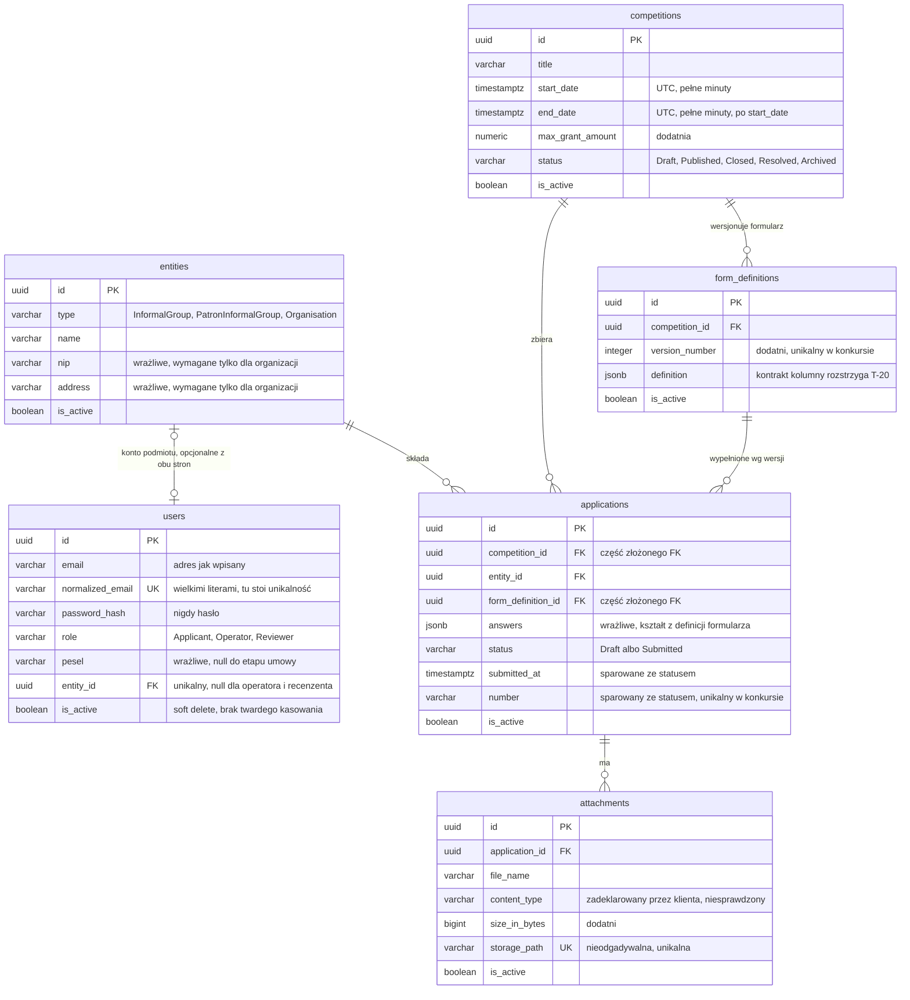
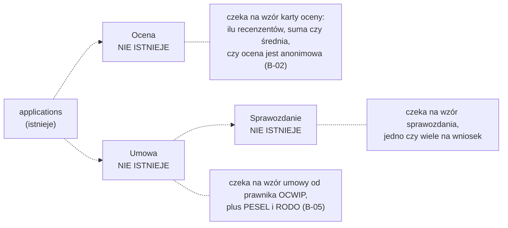

# Model danych

Stan: **wszystkie sześć tabel pierwszego podejścia (`users`, `entities`, `competitions`, `form_definitions`, `applications`, `attachments`) są w `AppDbContext` i w migracjach.** Ten dokument opisuje kierunek i, co ważniejsze, jawnie oddziela ustalenia od założeń.

Kto przyjdzie do projektu za miesiąc, musi umieć odróżnić jedno od drugiego.

## Diagram

Sześć tabel, które istnieją. Nazwy tabel i kolumn są takie jak w bazie, żeby diagram dało się zestawić z migracją bez tłumaczenia. Pokazane są klucze i te kolumny, o których faktycznie się rozmawia, a nie wszystkie: pełną listę ma `\d <tabela>` w psql.



Trzy rzeczy, których diagram sam nie powie, a które są sednem tego modelu:

- **`applications` wskazuje na `form_definitions`, a nie na `competitions`**, mimo że trzyma oba klucze. Formularz da się edytować w trakcie naboru, więc wniosek musi pamiętać, według której wersji był wypełniany.
- **Klucz obcy na `form_definitions` jest złożony** i celuje w klucz alternatywny `(competition_id, id)`. Bez tego para konkurs plus wersja formularza mogłaby się rozjechać. Uzasadnienie w [`architektura.md`](architektura.md).
- **Żadna z tych relacji nie kasuje kaskadowo.** Retencja minimum 5 lat, więc `is_active` na każdej tabeli nie jest ozdobą, tylko jedynym sposobem "usuwania".

### Encje odroczone

Trzy encje, których na diagramie **nie ma i nie będzie do czasu, aż dostaniemy dokumenty**. Nie są zapomniane, są zablokowane.



Linie przerywane to miejsca, w których te encje **prawdopodobnie** się podepną. Prawdopodobnie, bo nawet krotność jest zgadywaniem: nie wiemy, czy jeden wniosek dostaje jedną ocenę czy kilka. Dlaczego tego nie modelujemy, mówi sekcja niżej.

## Encje, których świadomie NIE budujemy

**Ocena, Umowa, Sprawozdanie.**

Powód jest konkretny: nie mamy jeszcze realnych wzorów dokumentów. Nie widzieliśmy karty oceny, nie wiemy, ilu recenzentów ocenia jeden wniosek ani czy liczy się suma czy średnia punktów. Nie mamy wzoru umowy ani wzoru sprawozdania.

Modelowanie tego teraz byłoby zgadywaniem, a zgadywanie w modelu danych kosztuje najwięcej. Dokumenty dostaniemy od zamawiającego.

Każda z tych trzech czeka na konkretny papier, nie na czyjąś decyzję projektową:

| Encja | Czeka na | Karta |
|---|---|---|
| Ocena | Wzór karty oceny plus odpowiedź, ilu recenzentów ocenia jeden wniosek i czy liczy się suma czy średnia, oraz czy recenzent widzi dane podmiotu | B-02 |
| Umowa | Wzór umowy od prawnika OCWIP. Tu wchodzą PESEL-e, więc razem z nim wchodzi RODO | B-05 |
| Sprawozdanie | Wzór sprawozdania. Bez niego nie wiemy nawet, czy jest jedno na wniosek, czy kilka cząstkowych | B-02 (ta sama rozmowa) |

Lepiej mieć sześć tabel pewnych niż dziewięć zmyślonych. Dopóki te wiersze mają wypełnioną kolumnę "czeka na", encji nie ma w schemacie.

## Encje planowane w pierwszym podejściu

### Użytkownik (`users`)

Konto do logowania. Ma rolę: operator, wnioskodawca albo recenzent.

Istnieje. Rola trzymana jako tekst, tak samo jak status konkursu i z tego samego powodu. Domyślną rolą jest `Applicant`, zapisaną zarówno w encji, jak i jako wartość domyślna kolumny, żeby insert omijający EF, czyli dokładnie ta droga, którą powstaje operator, też lądował na najmniej uprzywilejowanej roli. Jest to **jedyny** enum tekstowy w tym schemacie ograniczony check constraintem do swoich wartości (`ck_users_role_is_known`), bo jako jedyny jest kolumną uprawnień zapisywaną ręcznym SQL-em, gdzie `'operator'` małą literą zostawiłoby konto w roli, której nie dopasuje żadna reguła. Roli operatora nie nadaje żaden endpoint ani ekran, tylko komenda `grant-role`, patrz [`architektura.md`](architektura.md). Na roli nie ma żadnego ograniczenia unikalności i ta nieobecność ma **test dowodzący**, że constraintu nie ma: konkursy w OCWIP prowadzi więcej niż jedna osoba. E-mail unikalny indeksem w bazie, nie sprawdzeniem w kodzie: `SELECT` przed `INSERT` przegrywa wyścig z drugą rejestracją w tej samej chwili, a dwa konta na jeden adres psują reset hasła. Indeks stoi na `normalized_email`, czyli na adresie zapisanym wielkimi literami, i to jest **ustalenie, nie założenie**: `Adam@x.pl` i `adam@x.pl` to jedno konto. Wcześniej unikalność stała na adresie jak wpisany, więc oba były przyjmowane, a reset hasła miał dwa wiersze do wyboru. `Pesel` jest nullable, bo pojawia się dopiero na etapie umowy, a wymagana kolumna kazałaby każdemu wcześniejszemu kontu nosić wartość zastępczą, która przechodzi każdą walidację. Relacja do podmiotu jest opcjonalna, bo operator i recenzent pracują dla OCWIP i nie składają wniosków. Znaczniki czasu to `DateTimeOffset`, nie `DateTime`: `DateTime` zmapowany na `timestamptz` tylko przenosi problem na `DateTimeKind`, patrz [`architektura.md`](architektura.md).

Konto dziedziczy po ASP.NET Core Identity, ale tabela nadal nazywa się `users`, a decyzja i jej cena są w [`architektura.md`](architektura.md). Trzy rzeczy z tego wynikają dla schematu.

**Weryfikacja adresu to `email_confirmed` z Identity, nie nasza flaga.** Kolumna `is_verified` została usunięta. Jedno pole na jeden fakt: weryfikację zapisuje `UserManager` w T-12.2, więc druga flaga byłaby tą, której nikt nie aktualizuje.

**Trzy tabele Identity stoją puste:** `user_claims`, `user_logins` i `user_tokens`. Nie wydajemy claimów (rola jest kolumną), nie mamy logowania zewnętrznego ([`zakres.md`](zakres.md) nie przewiduje SSO) i nie przechowujemy tokenów aplikacji uwierzytelniającej. Nie da się ich usunąć bez napisania własnego `IUserStore`, czyli bez pisania tego, czego uniknięcie jest sensem wyboru Identity, więc zostają i są objęte sprawdzeniem pustości w `scripts/seed.py`.

**Trzech kolumn Identity nie ma w modelu:** `phone_number`, `phone_number_confirmed` i `two_factor_enabled`, wyłączone przez `Ignore`. Nieobecność ma test dowodzący. Adres jest w tabeli dwukrotnie więcej, niż wymaga domena: `user_name` i `normalized_user_name` powtarzają e-mail, bo Identity wymaga nazwy użytkownika, a my identyfikujemy konto adresem. Nazwa użytkownika **nie ma** indeksu unikalnego, żeby duplikat rejestracji zawsze padał na jednej, przewidywalnej nazwie constraintu.

### Podmiot (`entities`)

Ten, kto składa wniosek. **To nie jest to samo co użytkownik.**

Jedna encja z polem typu, nie trzy tabele. Trzy typy: grupa nieformalna, grupa nieformalna pod patronatem organizacji, organizacja. NIP i adres są wymagane tylko dla organizacji, więc walidacja jest zależna od typu, a nie wymuszona przez NOT NULL na wszystkich kolumnach. Podmiot bez NIP-u to nie błąd danych, to grupa nieformalna.

Istnieje. Wymagalność zależna od typu **nie jest** też check constraintem, i to jest decyzja, nie przeoczenie: nie wiemy, czy grupa pod patronatem organizacji podaje NIP patrona, więc schemat by tu zgadywał. Ta walidacja siedzi na brzegu API. Typ trzymany jako tekst w kolumnie na 30 znaków, bo `PatronInformalGroup` ma już 19 i przyjęte dla pozostałych enumów 20 nie zostawiałoby miejsca na zmianę nazwy.

### Konkurs (`competitions`)

Data i godzina startu oraz zamknięcia (UTC, pełne minuty), maksymalna kwota dotacji, wymagane załączniki, status.

Istnieje. Status trzymany jako tekst, nie jako ordynał enuma: wstawienie albo przestawienie wartości w `CompetitionStatus` przeinterpretowałoby po cichu wszystkie istniejące wiersze. Baza pilnuje dwóch rzeczy, których komentarz nie utrzyma: `start_date < end_date` (inaczej powstaje konkurs zamknięty przed otwarciem, do którego nigdy nie da się złożyć oferty) oraz `max_grant_amount > 0`. Okno konkursu przechowywane w pełnych minutach: settery `StartDate` i `EndDate` ucinają sekundy, a dwa check constraints pilnują tego samego w bazie, żeby insert omijający encję nie wpisał `12:00:30`. Ucinanie celowo nie jest konwerterem, powód w [`architektura.md`](architektura.md). Znaczniki audytowe (`created_at`, `updated_at`) zachowują pełną precyzję, bo odpowiadają na inne pytanie. Indeks na `(status, end_date)`, bo po tej parze filtruje się publiczna lista konkursów. Wymagane załączniki jeszcze nie istnieją, wchodzą razem z encją załącznika.

### Definicja formularza (`form_definitions`)

Struktura formularza jako dokument JSONB plus numer wersji. Wersjonowana, bo operator może edytować formularz w trakcie życia konkursu.

Zawartość tego JSON-a, czyli jak wyglądają sekcje, pola i walidacje, jest osobnym, dużym tematem. Kontrakt tej kolumny powstaje w osobnej karcie.

Istnieje. Numer wersji jest unikalny w obrębie konkursu, nie globalnie: wersja 1 musi móc istnieć w każdym konkursie, a dwa wiersze z tą samą wersją w jednym konkursie odbierałyby możliwość stwierdzenia, przeciw której wersji formularza wypełniono ofertę. Numer wersji musi być dodatni, a korzeń JSON-a musi być obiektem albo tablicą, oba pilnowane check constraintem: bez tego kolumna przyjmuje `-7` jako wersję i `123` jako definicję formularza. Który z dwóch korzeni wybierze kontrakt, decyduje T-20, więc constraint tego nie przesądza. JSON siedzi w kolumnie jako `JsonElement`, nie `JsonDocument`: EF nigdy nie zwalnia zmaterializowanych instancji, a `JsonDocument` jest `IDisposable` i oparty o `ArrayPool`, więc zapytanie listujące alokowałoby jedną na wiersz.

### Wniosek (`applications`)

Odpowiedzi jako JSONB. Wskazuje na Podmiot oraz **na konkretną wersję definicji formularza, nie na konkurs.** Uzasadnienie w [`architektura.md`](architektura.md).

Brak ograniczenia unikalności na parze podmiot plus konkurs: jeden podmiot może złożyć kilka ofert w jednym konkursie.

Istnieje. Ta nieobecność jest wymogiem, nie luką, więc ma **test dowodzący, że constraintu nie ma**. Komentarz by nie przeżył pierwszej osoby, która dostrzeże "oczywisty brakujący constraint".

Wniosek trzyma obok siebie `competition_id` i `form_definition_id`, choć wersja formularza sama należy do konkursu. Dwa zwykłe klucze obce pozwoliłyby tej parze się rozjechać, więc klucz obcy na definicję formularza jest **złożony** i wskazuje na klucz alternatywny `(competition_id, id)`. Powód i alternatywy w [`architektura.md`](architektura.md).

Status jest jednym z dwóch: `Draft` albo `Submitted`. Dalsze stany, czyli wszystko, co dzieje się na liście rankingowej, należą do encji oceny, której świadomie nie budujemy. Data złożenia i numer wniosku są sparowane ze statusem osobnymi check constraintami: złożonej oferty, której nikt nie potrafi zadatować, nie da się użyć w sporze o termin, a wersja robocza z datą złożenia czyta się jednocześnie jako niewysłana i wysłana. Numer nadawany jest przy złożeniu, więc wersja robocza go nie ma i nie zużywa, bo rejestr z lukami po nigdy niezłożonych wersjach roboczych jest rejestrem, którego operator nie umie wyjaśnić wnioskodawcy. Korzeń JSON-a z odpowiedziami musi być obiektem albo tablicą, tym samym constraintem co przy definicji formularza.

### Załącznik (`attachments`)

Na tym etapie tylko metadane pliku i powiązanie z wnioskiem. Fizyczne przechowywanie plików to osobny temat.

Istnieje: nazwa pliku, typ MIME, rozmiar, ścieżka w storage. Typ MIME jest **zadeklarowany przez klienta, nie sprawdzony**, i kolumna mówi to wprost, bo inaczej następny czytający uzna ją za wiarygodną. Rozmiar musi być dodatni, bo załącznik zerobajtowy to nieudany upload, nie dokument. Ścieżka w storage jest unikalna: dwa wiersze wskazujące na jeden plik zamieniają usunięcie pliku w sposób psucia cudzego załącznika. Ścieżka nie może dać się zgadnąć, a pobranie musi przechodzić tę samą kontrolę uprawnień co sam wniosek, bo załącznik to dokument cudzej organizacji. Jedno i drugie realizuje T-32, tutaj jest tylko zapisane przy kolumnie.

## Jawne założenia do potwierdzenia

Są to **założenia**, nie ustalenia. Potwierdzić z zamawiającym.

Termin, do którego odwoływały się karty T-11.2, T-11.3 i T-11.4, czyli spotkanie 27.08, **minął, a założenia zostały niepotwierdzone**. Prowadzi to karta B-09 i tam jest checklista do przejścia. Cztery z tych pozycji są już wypalone w schemacie: relacja użytkownik do podmiotu, zakres unikalności numeru wniosku, moment jego nadania oraz zachowanie dezaktywowanego konta. Każda z nich, jeśli jest błędna, oznacza migrację, a nie poprawkę w kodzie. Dziś migracja jest bezkosztowa, bo baza jest pusta. Po pierwszych prawdziwych danych przestaje być.

Potwierdzoną pozycję przenosi się **z tej tabeli do treści właściwej sekcji wyżej**, żeby następna osoba widziała różnicę między ustaleniem a domysłem.

| Założenie | Skąd się wzięło | Co się stanie, jeśli jest błędne |
|---|---|---|
| Użytkownik do Podmiotu jeden do jednego | Nie wiemy, czy w organizacji wniosek może składać kilka osób z osobnych kont | Trzeba dodać tabelę pośredniczącą i przemyśleć uprawnienia w obrębie podmiotu |
| Jedna rola na użytkownika | Na spotkaniu nie padło nic o osobie, która jest jednocześnie operatorem i recenzentem | Rola przestaje być kolumną, staje się relacją, a `ck_users_role_is_known` i wartość domyślna kolumny znikają razem z nią |
| Sprawozdanie jest jedno na wniosek | Standard w małych dotacjach, ale nie ustalone | Relacja jeden do wielu, plus statusy sprawozdań cząstkowych |
| Brak aneksów do umów | Na spotkaniu nie padło ani słowo | Umowa zyskuje wersjonowanie, podobnie jak definicja formularza |
| Numer wniosku nadawany przy złożeniu, nie przy utworzeniu wersji roboczej | Wersja robocza, której nikt nie złożył, zużywałaby numer i zostawiała lukę w rejestrze | Numer staje się kolumną wymaganą od utworzenia, a check constraint parujący go ze statusem znika |
| Numer wniosku unikalny w obrębie konkursu, nie globalnie | Nie znamy schematu numeracji OCWIP. Unikalność globalna odrzuciłaby numer "001" w drugim konkursie, czyli poprawne dane | Nic. Ten zakres nie odrzuca niczego, co wyprodukowałby schemat globalny, bo numer globalnie unikalny jest też unikalny w konkursie |
| Numer wniosku raz nadany nie wraca do puli, nawet gdy wniosek zostanie wycofany | Indeks unikalny na `(competition_id, number)` obejmuje wszystkie wiersze, a reguła 1 zabrania twardego kasowania | Indeks staje się częściowy (`WHERE is_active`), a numer zwolniony przez wycofany wniosek może trafić do kolejnego wnioskodawcy |
| Dezaktywowane konto zachowuje swój e-mail i swój podmiot na zawsze, więc drogą powrotną jest reaktywacja, a nie ponowna rejestracja | Indeksy unikalne na `normalized_email` i `entity_id` obejmują wszystkie wiersze, a reguła 1 zabrania twardego kasowania, więc wiersz nigdy nie zwalnia adresu | Oba indeksy stają się częściowe (`WHERE is_active`), a rejestracja przestaje być jedyną drogą wejścia dla wcześniej dezaktywowanego konta |

## Otwarte punkty implementacyjne

Nie założenia o domenie, tylko rzeczy, których schemat świadomie nie rozstrzyga, a które ugryzą kartę wdrażającą ścieżkę zapisu.

- **Nadawanie numeru wniosku.** Schemat wymaga numeru dokładnie w tej samej instrukcji, która ustawia status na `Submitted`, a para `(competition_id, number)` jest unikalna. Nic w schemacie tego numeru nie przydziela: nie ma sekwencji, wartości domyślnej ani blokady. Dwóch wnioskodawców klikających "Złóż" w tej samej sekundzie odczyta ten sam `MAX(number)` i jeden dostanie 23505 przy próbie złożenia, która może być sekundy od odcięcia co do minuty. Strategię przydziału (sekwencja per konkurs, blokada doradcza albo ponowienie) wybiera karta domykająca składanie wniosku.
- **Reaktywacja konta.** Patrz ostatni wiersz tabeli powyżej. Dezaktywowane konto blokuje swój adres (przez `normalized_email`) i swój podmiot, więc T-12.1 musi mieć ścieżkę reaktywacji, bo sama rejestracja nie da się pogodzić z regułą "nie ujawniamy, czy konto istnieje".
- **Szyfrowanie odpowiedzi wniosku.** T-80 nie może zaszyfrować całej kolumny `answers`: szyfrogram nie jest ani obiektem, ani tablicą, więc padłby check constraint, a razem z kolumną jsonb zniknęłaby wyszukiwalność, po którą jsonb został wybrany. Szyfrowane są pola WEWNĄTRZ dokumentu, nie dokument.
- **Szerokości kolumn wrażliwych.** `nip` na 10 znaków i `pesel` na 11 mieszczą dokładnie tekst jawny i zero szyfrogramu. T-80 musi te kolumny poszerzyć, inaczej pierwszy zaszyfrowany zapis wywali 22001.

## Reguły, które model musi respektować

1. Zero `ON DELETE CASCADE`. Retencja minimum 5 lat wyklucza twarde kasowanie. Soft delete to `IsActive` plus nullable `DeactivatedAt`, sparowane check constraintem, patrz [`architektura.md`](architektura.md).
2. Wszystkie znaczniki czasu w UTC. Wymusza to `UtcDateTimeOffsetConverter` na każdej właściwości `DateTimeOffset`, patrz [`architektura.md`](architektura.md).
3. Klucze główne jako UUID (`gen_random_uuid()`), nie sekwencje. Identyfikator wniosku pojawia się w adresie URL, a sekwencja mówi konkurentowi, ile wniosków wpłynęło i pozwala zgadywać cudze.
4. Każde pole trzymające dane wrażliwe (PESEL, NIP, adres osoby fizycznej) oznaczone komentarzem w kodzie.

## Dane testowe

Jedna komenda na wstającym stacku:

```bash
python scripts/seed.py
```

Wstawia dokładnie to, czego wymagają testy uprawnień, a nie ozdobę: jednego operatora, dwóch wnioskodawców, jeden konkurs i dwa wnioski, z czego jeden roboczy i jeden złożony. Do tego jedna definicja formularza w wersji 1 i jeden załącznik przy złożonym wniosku, żeby żadna z sześciu tabel nie została pusta.

| Wiersz | Szczegół, który ma znaczenie |
|---|---|
| Operator | Bez podmiotu. Prowadzi konkurs dla OCWIP, nie składa wniosku |
| Wnioskodawca 1 | Podmiot typu `Organisation`, z NIP-em i adresem |
| Wnioskodawca 2 | Podmiot typu `InformalGroup`, bez NIP-u i adresu. To nie jest brak danych, to drugi z trzech typów podmiotu |
| Konkurs | `Published`, otwarty: zaczął się tydzień temu, kończy za trzydzieści dni. Zamknięty konkurs jest bezużyteczny do tego, po co seed powstał |
| Wniosek złożony | Ma numer `001` i datę złożenia, bo schemat paruje jedno i drugie ze statusem osobnymi check constraintami |
| Wniosek roboczy | Nie ma ani numeru, ani daty. Należy do **drugiego** wnioskodawcy, i ten podział jest sensem seeda: dopiero on czyni z sięgnięcia po cudzy wniosek przypadek, który T-13.3 ma jak przetestować |

Trzy rzeczy, o które ktoś zapyta:

1. **Żadne z tych kont się nie zaloguje.** Hashowanie haseł wchodzi z rejestracją w T-12.1, więc kolumna dostaje jawny placeholder, a nie coś, co wygląda jak poświadczenie.
2. **Żadne konto nie ma PESEL-u.** Pojawia się dopiero na etapie umowy, a zmyślony numer w tej kolumnie przechodzi każdą walidację, jaka istnieje.
3. **Identyfikatory są stałe** (`00000000-0000-4000-a000-0000000000NN`), żeby test, zgłoszenie błędu i adres URL mogły cytować ten sam wiersz na każdej maszynie.

Skrypt **odmawia**, gdy w bazie są jakiekolwiek wiersze, i nie zmienia wtedy niczego. Reset to `docker compose down -v && docker compose up -d`. Powód wyboru samego skryptu zamiast komendy w API jest w [`architektura.md`](architektura.md).

Testy bazodanowe nie korzystają z seeda: zasiewają swój własny łańcuch (konkurs, wersja definicji formularza, podmiot) przez `TestApplicationChain`, żeby nie zależeć od stanu przygotowanego z zewnątrz.
